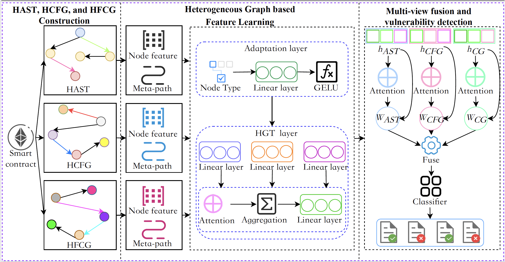

# Smart Contract Vulnerability Detection Method Based on Multi-View Fusion

This method first parses the contract source code and constructs three types of heterogeneous graphs, which are HAST (Heterogeneous Abstract Syntax Tree), HCFG (Heterogeneous Control Flow Graph), and HFCG (Heterogeneous Function Call Graph). Then, it uses Multi-Level Graph Neural Networks to independently learn the features of these three types of graphs to more comprehensively capture the grammatical and semantic features of the contract. Finally, the features are fused with an Attention Network, and a classifier is used to detect whether vulnerabilities exist in the contract and to identify their specific type.

## System Description

We run all experiments on:

- **Windows 11**  
- **CUDA 11.1**  
- **NVIDIA 4090**
- **Python 3.9.12**

---
## Datasets


Download the dataset from the following link:

👉 [https://github.com/MANDO-Project/ge-sc/tree/master/experiments/ge-sc-data/source_code](https://github.com/MANDO-Project/ge-sc/tree/master/experiments/ge-sc-data/source_code)

---
## Install Environment

Install Python required packages:

```bash
pip install -r requirements.txt
```

---
## HAST, HCFG, and HFCG Construction

Run the following commands to build the heterogeneous abstract syntax tree, heterogeneous function call graph, and heterogeneous control flow graph respectively:
```bash
cd process_graphs
python ast_graph_generator.py
python call_graph_generator.py
python control_flow_graph_generetor.py
```

---
## Heterogeneous Graph based Feature Learning

Modify the path to generate vectors of heterogeneous abstract syntax trees, heterogeneous control flow graphs, and heterogeneous function call graphs
```bash
python -m graph_classification --epochs 50 --repeat 20
```

The heterogeneous graph feature learning code can also be downloaded from [https://github.com/MANDO-Project/ge-sc](https://github.com/MANDO-Project/ge-sc).


---
## Multi-view fusion and vulnerability detection
Run the following commands respectively to generate three graphs and detect contract vulnerabilities.
```bash
python TrainAttention.py
cd ClassifierFusion
python LogisticRegreesion.py
```


